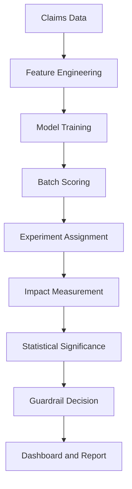

# Claim FDS
## 정책 효과 검증 및 확장 의사결정 시스템

---

# 1. 목적

본 시스템은 보험금 사기 탐지 모델의 예측 성능 자체가 아니라  
정책 적용에 따른 재무 효과를 검증하기 위한 구조임  

핵심 목적은 다음과 같음

- 통제군 대비 처리군 재무 절감 효과 측정
- 통계적 유의성 확보 여부 판단
- 세그먼트별 효과 차이 분석
- 가드레일 통과 시에만 정책 확대

---

# 2. 전체 아키텍처


---

# 3. 운영 흐름 (End-to-End Flow)

① 데이터 적재  
- 파일: data/claims.csv  
- 로딩 함수: src/io_utils.py → load_claims()

② 피처 생성  
- 파일: src/features.py  
- 함수: build_features()  
- 범주형 인코딩, 수치 정규화, 파생 변수 생성했음

③ 모델 학습  
- 파일: src/train.py  
- 함수: train_model()  
- 검증: src/validate.py → evaluate_model()  
- 확률 보정: src/calibrate.py → calibrate_model()

④ 배치 스코어링  
- 파일: src/score_batch_prod.py  
- 함수: score_batch()  
- 결과: out/decision_ledger.csv 생성했음

⑤ 실험군 배정  
- 파일: src/experiment.py  
- 함수: assign_experiment_group()  
- Treatment 비중 설정 가능함

⑥ 효과 측정  
- 파일: src/impact_panel.py  
- 함수: compute_panel_impact()  
- 통제군·처리군 평균 지급액 계산했음

⑦ 통계 검정  
- 파일: src/stats_impact_scipy.py  
- 함수: welch_ttest()  
- p-value 산출했음

⑧ 가드레일 판정  
- 파일: src/guardrails.py  
- 함수: evaluate_guardrails()  
- GO / HOLD / ROLLBACK 판정했음

⑨ 세그먼트 경보  
- 파일: src/segment_alerts.py  
- 함수: detect_segment_anomaly()

⑩ 리포트 생성  
- 파일: src/executive_report.py  
- 함수: generate_summary()  
- PDF: src/pdf_onepager.py → create_pdf()

⑪ 대시보드 표시  
- 파일: app_exec_dashboard.py  
- out/*.csv 기반 지표 렌더링했음

---

# 4. 대시보드 지표 산출 매핑

| 지표 | 계산 로직 | 파일 | 함수 |
|------|-----------|------|------|
| MTD 절감 | 월 누적 (통제-처리) 합 | impact_panel.py | compute_panel_impact |
| QTD 절감 | 분기 누적 합 | impact_panel.py | compute_panel_impact |
| 건당 지급 개선 | avg_control - avg_treatment | impact_panel.py | compute_panel_impact |
| 검토 전환율 | review_flag 비율 | experiment.py | assign_experiment_group |
| Treatment 비중 | treatment / total | experiment.py | assign_experiment_group |
| p-value | Welch t-test | stats_impact_scipy.py | welch_ttest |
| Guardrail 상태 | 조건 기반 판정 | guardrails.py | evaluate_guardrails |
| 세그먼트 경보 | 이상치 탐지 | segment_alerts.py | detect_segment_anomaly |

---

# 5. 적용 통계 이론 및 수식

| 항목 | 수식 | 적용 파일 | 설명 |
|------|------|-----------|------|
| 평균 효과 (ATE) | Δ = E[Y|C] − E[Y|T] | impact_panel.py | 지급 평균 차이 |
| HTE | HTE_s = E[Y|C,S=s] − E[Y|T,S=s] | impact_panel.py | 세그먼트별 효과 |
| Welch t-test | t = (μ_c − μ_t) / √(σ_c²/n_c + σ_t²/n_t) | stats_impact_scipy.py | 등분산 가정 없음 |
| p-value | P(T > t) | stats_impact_scipy.py | 통계적 유의성 판단 |

---

# 6. Guardrail 로직

확대 조건은 다음을 모두 충족해야 함

- p-value < threshold  
- Δ > 0  
- 세그먼트 이상 급증 없음  

위반 시 자동 HOLD 또는 ROLLBACK 처리했음

---

# 7. 실행 방법

## 환경 구성

```bash
python -m venv .venv
source .venv/bin/activate
pip install -r requirements.txt
```

## 전체 실행

```bash
python -m src.train
python -m src.score_batch_prod
python -m src.experiment
python -m src.impact_panel
python -m src.stats_impact_scipy
python -m src.guardrails
python -m src.executive_report
streamlit run app_exec_dashboard.py
```

---

# 8. Streamlit Cloud 배포

1. GitHub 업로드했음  
2. https://streamlit.io/cloud 접속  
3. app_exec_dashboard.py 선택  
4. Deploy 완료  

배포 URL

https://awesome-fds-9qyj9byrubzicscijfsgnh.streamlit.app/

---

# License

Internal Use Only
