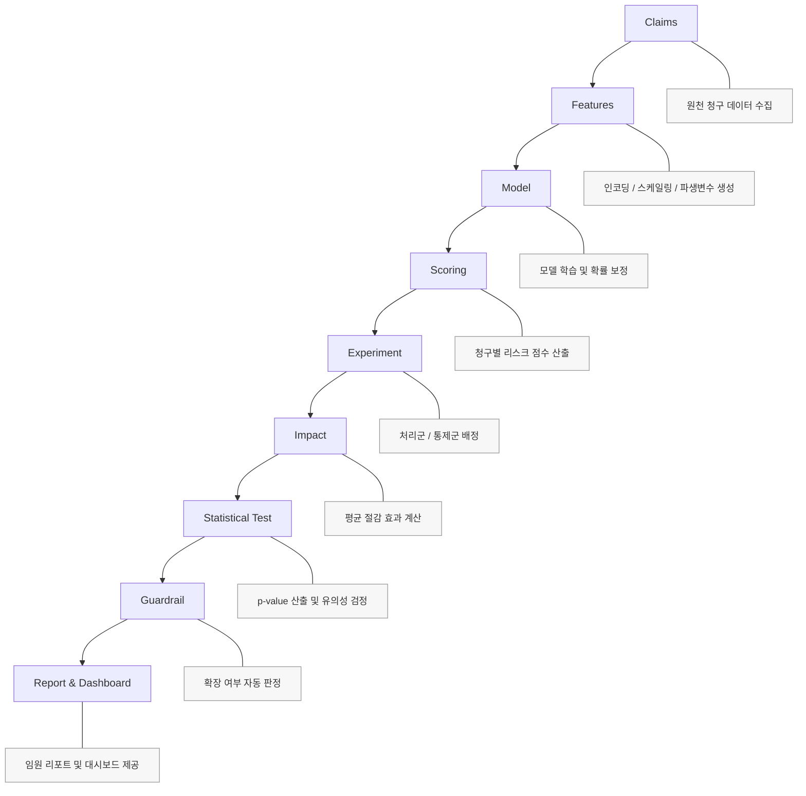

# Claim FDS
## 심사 정책 효과 검증 및 확장 의사결정 시스템

---

# 1. 목적

본 시스템은 보험금 사기 탐지 모델을 “예측 성능” 중심으로 운영하기 위한 도구가 아니라  
** 심사 정책 적용 효과(비용 절감)를 측정하고 확대 여부를 판단하기 위한 운영 체계**

핵심 목적은 다음과 같음  

- 통제군 대비 처리군의 **재무 절감 효과** 비교
- 효과의 **통계적 유의성** 검증
- **세그먼트별 효과 차이(HTE)** 확인
- **가드레일** 통과 시에만 정책 확대하도록 설계
- 결과를 대시보드 및 리포트 산출물로 일괄 제공

---

# 1.1 Executive Summary (임원 요약)

본 FDS는 “모델 성능”이 아니라 “정책 효과”를 검증·확장하는 운영 체계로 설계되었음.  
의사결정은 **재무 효과 → 통계적 신뢰 → 운영 리스크(Guardrail)** 순으로 고정했음.

- **재무 효과(절감)**: 처리군 vs 통제군 지급액 차이로 절감 규모 산출했음  
- **유의성(신뢰)**: Welch t-test로 우연 가능성(p-value) 통제했음  
- **확장 전략**: HTE로 세그먼트별 효과 차이를 확인해 선택적 확대 가능하도록 했음  
- **리스크 통제**: Guardrail 미충족 시 GO 금지(hold/rollback)하도록 설계했음

# 2. 주요 기능

- 청구 단위 리스크 점수 산출 및 처리/통제 실험 
- 지급액(원) 기반 효과(절감) 및 검토 전환율 변화 측정 
- Welch t-test 기반 유의성 검정 및 p-value 산출
- 세그먼트 경보 및 가드레일 판정으로 안전장치 구성
- One-pager PDF 및 이메일 리포트 자동 생성
- Streamlit 대시보드에서 “핵심 메시지 → 근거 → 실행 권고” 구조 서비스

---

# 3. 기술 스택

- Python 3.10+
- Streamlit 대시보드 제공 
- pandas / numpy 기반 데이터 처리 
- SciPy 기반 통계 검정(Welch t-test) 활용
- joblib 기반 모델 직렬화(Champion/Challenger) 사용  
- ReportLab 기반 One-pager PDF 생성
- SMTP 기반 이메일 발송 모듈 포함 

---

# 4. 전체 아키텍처

<div align="left">



</div>

---

# 5. 아키텍처 구성요소별 목적 및 수행 내용

| 구성요소 | 목적 | 주요 파일 |
|---|---|---|
| Claims Data | 분석/운영 입력 확보 | `data/claims.csv`, `src/io_utils.py` |
| Feature Engineering | 모델 입력 정규화 | `src/features.py` |
| Model Training | 점수 산출 모델 생성 | `src/train.py`, `src/validate.py`, `src/calibrate.py` |
| Batch Scoring | 운영 점수 생성 | `src/score_batch_prod.py` → `out/decision_ledger.csv` |
| Experiment Assignment | 효과 측정 설계 | `src/experiment.py` (`assign_group`) |
| Impact Measurement | 재무 효과 산출 | `src/impact_panel.py`, `out/impact_panel.csv` |
| Statistical Significance | 유의성 검증 | `src/stats_impact_scipy.py`, `out/impact_significance_scipy.csv` |
| Segment Alerts | 리스크 집중 감시 | `src/segment_alerts.py` (`bh_fdr`) |
| Guardrail Decision | 확장 안전장치 | `src/guardrails.py` (`main`, `_emit`) |
| Report Generation | 결과 산출물 제공 | `src/executive_report.py`, `src/pdf_onepager.py`, `src/executive_charts.py` |
| Dashboard & Email | 소비 채널 제공 | `app_exec_dashboard.py`, `src/send_report_email.py` |

---

# 6. 레포 구조

```
app_exec_dashboard.py
requirements.txt
Makefile
.env.example
.streamlit/

assets/
data/
models/
out/
src/
scripts/   # (추가) 운영 재현 스크립트
```

---

# 7. 운영 흐름 (End-to-End) — 상세 단계

아래 단계는 “산출물(out/) 생성 → 대시보드 렌더링”까지 표준 경로임

## 7.1 데모 산출물 생성
- 파일: `src/simulate_production_outputs.py`
- 목적: 운영 산출물(out/)을 모조 데이터로 일괄 생성 
- 실행: `python -m src.simulate_production_outputs --scenario GO --days 120 --seed 42`  

## 7.2 운영형 전체 파이프라인 (학습→스코어링→효과→리포트)
- 학습: `python -m src.train`
- 검증: `python -m src.validate`
- 보정: `python -m src.calibrate`  
- 스코어링: `python -m src.score_batch_prod`  
- (선택) C/C 비교: `python -m src.score_cc`  
- 실험 배정: `python -m src.experiment`  
- 효과 측정: `python -m src.impact_panel`  
- 유의성: `python -m src.stats_impact_scipy`  
- 세그먼트 경보: `python -m src.segment_alerts`  
- 가드레일: `python -m src.guardrails`  
- 리포트/차트: `python -m src.executive_report`, `python -m src.executive_charts`  
- PDF: `python -m src.pdf_onepager`   
- 대시보드: `streamlit run app_exec_dashboard.py`  

---

# 8. 대시보드 UI 라벨(한글) ↔ KPI 매핑 1:1

본 섹션은 `app_exec_dashboard.py` 기준으로 “화면 표시 라벨”에 대한 기록  

## 8.1 상단 KPI 영역
| 표시 라벨 | 산출 값 | 주요 입력 | 계산 위치 |
|---|---|---|---|
| `MTD 절감(추정)` / `월 절감(추정)` | 월 누적 절감 추정 | `out/impact_monthly_timeseries.csv` 우선, 없으면 `out/decision_ledger.csv` | `src/telemetry.py` → `compute_saving_kpis()` |
| `금일 청구 건수` | 금일 청구 n | `out/decision_ledger.csv` | `src/telemetry.py` → `compute_ops_kpis()` |
| 배지 `GO/HOLD/ROLLBACK`, `p=...`, `경보 0건` | 상태/참고값 | `out/guardrails_decision.csv`, `out/segment_alerts.csv` | `app_exec_dashboard.py` → `guardrail()` |

## 8.2 KPI 탭 라벨
- KPI 탭: `재무 성과`, `운영 지표`, `품질·가드레일`  
- 페이지 탭: `임원 요약`, `효과 분석`, `세그먼트·요인`, `운영`, `근거`  

## 8.3 카드 라벨
아래 라벨은 `card("...")` 호출하여 산출

- `MTD 절감(추정)`, `SLA 위반`, `가드레일 상태`, `건당 지급 개선액`, `검토 전환율`, `관측 효과(건당)`, `금일 청구 건수`, `기간 청구 건수`, `대기 건수`, `분기 누적 절감(추정)`, `세그먼트 경보`, `월 절감(추정)`, `유의확률(p)`, `처리 비중`, `처리 완료`, `처리군 표본수`, `총 청구 건수`, `통제군 표본수`, `평균 리스크 점수`
- 진행(미니): `월 목표 달성률`

---

# 9. 지표(카드)별 입력파일 ↔ 계산 함수 ↔ 상위 산출 로직 매핑

<table>
<colgroup>
<col style="width: 28%;">
<col style="width: 24%;">
<col style="width: 28%;">
<col style="width: 20%;">
</colgroup>
<thead><tr>
<th>표시 라벨</th>
<th>입력(out/)</th>
<th>계산/포맷 함수</th>
<th>상위 산출 스크립트</th>
</tr></thead>
<tbody>
<tr>
<td><code>MTD 절감(추정)</code> / <code>월 절감(추정)</code></td>
<td><code>impact_monthly_timeseries.csv</code>(우선) / <code>decision_ledger.csv</code>(fallback)</td>
<td><code>src.telemetry.compute_saving_kpis()</code> 내부에서 <code>compute_savings_from_timeseries()</code> → fallback <code>compute_savings_from_ledger()</code></td>
<td>데모: <code>simulate_production_outputs.py</code> / 운영: <code>impact_panel.py</code> + ledger</td>
</tr>
<tr>
<td><code>오늘 절감(추정)</code>(리포트/근거 영역)</td>
<td>동일</td>
<td><code>src.telemetry.compute_saving_kpis()</code> → <code>saving_today</code></td>
<td>동일</td>
</tr>
<tr>
<td><code>분기 누적 절감(추정)</code></td>
<td>동일</td>
<td><code>src.telemetry.compute_saving_kpis()</code> → <code>saving_qtd</code></td>
<td>동일</td>
</tr>
<tr>
<td><code>금일 청구 건수</code></td>
<td><code>decision_ledger.csv</code></td>
<td><code>src.telemetry.compute_ops_kpis()</code> → <code>n_claims_today</code></td>
<td><code>score_batch_prod.py</code></td>
</tr>
<tr>
<td><code>검토 전환율</code></td>
<td><code>decision_ledger.csv</code></td>
<td><code>src.telemetry.compute_ops_kpis()</code> → <code>review_rate</code></td>
<td><code>experiment.py</code> + ledger</td>
</tr>
<tr>
<td><code>처리 비중</code></td>
<td><code>decision_ledger.csv</code></td>
<td><code>src.telemetry.compute_ops_kpis()</code> → <code>treat_share</code></td>
<td><code>experiment.py</code></td>
</tr>
<tr>
<td><code>평균 리스크 점수</code></td>
<td><code>decision_ledger.csv</code></td>
<td><code>src.telemetry.compute_ops_kpis()</code> → <code>avg_model_score</code></td>
<td><code>score_batch_prod.py</code></td>
</tr>
<tr>
<td><code>월 목표 달성률</code></td>
<td><code>impact_monthly_timeseries.csv</code> + 목표값</td>
<td><code>app_exec_dashboard.py</code> → <code>mini_progress()</code></td>
<td>목표: <code>src/config.py</code>(CFG)</td>
</tr>
<tr>
<td><code>가드레일 상태</code> / <code>유의확률(p)</code> / <code>세그먼트 경보</code></td>
<td><code>guardrails_decision.csv</code>, <code>segment_alerts.csv</code>, <code>impact_significance_scipy.csv</code></td>
<td><code>app_exec_dashboard.py</code> → <code>guardrail()</code> (배지/카드)</td>
<td><code>guardrails.py</code>, <code>segment_alerts.py</code>, <code>stats_impact_scipy.py</code></td>
</tr>
<tr>
<td><code>관측 효과(건당)</code> / <code>통제군 표본수</code> / <code>처리군 표본수</code></td>
<td><code>impact_panel.csv</code></td>
<td>대시보드에서 CSV 읽어 포맷(<code>krw</code>, <code>fmt_int</code>)</td>
<td><code>impact_panel.py</code></td>
</tr>
<tr>
<td><code>대기 건수</code> / <code>SLA 위반</code> / <code>처리 완료</code></td>
<td><code>review_queue.csv</code> 또는 ledger 파생</td>
<td><code>src.telemetry.compute_ops_kpis()</code> 또는 대시보드 집계</td>
<td>운영/데모 생성 로직</td>
</tr>
</tbody></table>

---

# 10. 통계/추정 로직 및 수식

## 10.1 평균 효과 (ATE)

정책 적용에 따른 평균 절감 효과는 다음과 같이 정의함.
$$
\Delta = \mathbb{E}[Y \mid C] - \mathbb{E}[Y \mid T]
$$

표본 기준 계산식:
$$
\Delta = \bar{Y}_C - \bar{Y}_T
$$

- $Y$: 지급액  
- $C$: 통제군  
- $T$: 처리군  

의미: 정책 적용 후 지급액이 감소했다면 $\Delta > 0$ 이며 절감 효과 발생을 의미함.

---

## 10.2 Welch t-test (평균 차이 유의성 검정)

두 집단 평균 차이가 우연인지 검정함.
$$
t =
\frac{\bar{X}_C - \bar{X}_T}
{\sqrt{\frac{s_C^2}{n_C} + \frac{s_T^2}{n_T}}}
$$

- $\bar{X}_C, \bar{X}_T$: 각 집단 평균  
- $s_C^2, s_T^2$: 분산  
- $n_C, n_T$: 표본 수  

p-value 계산:
$$
p = P(|T| \ge |t|)
$$

의미:

- ATE → 효과의 크기  
- t-test → 효과의 신뢰도  

---


## 10.3 HTE (세그먼트별 효과)

$$
HTE_s =
\mathbb{E}[Y \mid C, S=s]
-
\mathbb{E}[Y \mid T, S=s]
$$

- $S=s$: 특정 세그먼트  

전체 평균만으로는 확장 전략 수립이 어려우며,  
HTE는 “어디서 확대해야 하는가”를 결정하는 전략 지표임.

---


## 10.4 BH-FDR (다중검정 보정)

정렬된 p-value에 대해:

$$
p_{(i)} \le \frac{i}{m}\alpha
$$

- $m$: 검정 개수  
- $\alpha$: 유의수준  

목적: 우연히 좋아 보이는 세그먼트 제거 → 확장 리스크 통제

---


## 10.5 Guardrail 의사결정 조건

정책 확대 조건:

$$
Scale =
\begin{cases}
1 & \text{if } \Delta > 0 \land p < 0.05 \land \text{Risk Stable} \\
0 & \text{otherwise}
\end{cases}
$$

Scale =
\begin{cases}
1 & \text{if } \Delta > 0 \land p < 0.05 \land \text{Risk Stable} \\
0 & \text{otherwise}
\end{cases}
$$

---

# 12. 실행 방법

## 12.1 requirements 설치

```bash
python -m venv .venv
source .venv/bin/activate
pip install -r requirements.txt
```

설명:

- python -m venv .venv → 프로젝트 전용 가상환경 생성  
- source .venv/bin/activate → 가상환경 활성화
- pip install -r requirements.txt → 필요한 패키지 일괄 설치

---

## 12.2 데모 산출물 생성

```bash
python -m src.simulate_production_outputs --scenario GO --days 120 --seed 42
```

설명:

- 실제 운영 데이터 없이도 결과 파일을 생성하기 위한 시뮬레이션 모듈
- --scenario GO → 정책 효과가 발생하는 시나리오 생성  
- --days 120 → 120일치 데이터 생성 
- --seed 42 → 동일한 결과 재현 가능하도록 난수 고정 

산출물은 out/ 디렉토리에 생성

---

## 12.3 대시보드 실행
샘플 URL : https://awesome-fds-9qyj9byrubzicscijfsgnh.streamlit.app/ 

```bash
streamlit run app_exec_dashboard.py --server.address 0.0.0.0 --server.port 8501
```

설명:

- 0.0.0.0 설정 시 외부 접속 가능함 (GCP VM 기준)  
- 브라우저에서 http://<VM외부IP>:8501 접속 

---

## 12.4 Makefile 기반 실행 (권장)

Makefile은 여러 명령어 일괄 실행하도록 정의된 스크립트

```bash
# 1) 가상환경 생성 + requirements 설치
make install

# 2) 데모 산출물 생성
make demo

# 3) 대시보드 실행
make dashboard
```

### 각 명령어 내부 동작 설명

- make install  
  → 가상환경 생성  
  → pip install -r requirements.txt 실행  

- make demo  
  → simulate_production_outputs 실행  
  → 대시보드에 필요한 out/ 파일 자동 생성  

- make dashboard  
  → streamlit 실행  

---

### 풀 파이프라인 실행

```bash
make full
make dashboard
```

- make full  
  → 학습 → 스코어링 → 실험 배정 → 효과 측정 → 통계 검정까지 전체 실행

- 이후 make dashboard 실행하면 최신 결과 반영된 대시보드 확인 가능

---

## 12.5 Shell Script 기반 실행

Make 없이도 실행 가능하도록 bash 스크립트 제공

```bash
# 데모 실행 (권장)
bash scripts/run_all.sh demo

# 풀 파이프라인 실행
bash scripts/run_all.sh full
```

설명:

- demo → 빠르게 결과 확인용  
- full → 전체 모델 학습부터 통계 검정까지 수행  

---

# Appendix A. 통계 이론 설명 (샘플 데이터 예시 + 수식 포함)

아래는 단순 예시 데이터 기준 설명

예시:

CONTROL 지급액 (원)\
\[100, 120, 110, 130, 115\]

TREATMENT 지급액 (원)\
\[90, 95, 100, 105, 92\]

------------------------------------------------------------------------

## A.1 평균 처리 효과 (ATE: Average Treatment Effect)

### 1) 수식

ATE = E\[Y \| T=1\] − E\[Y \| T=0\]

또는 표본 기준으로:

ATE = (1/n₁)ΣY₁ − (1/n₀)ΣY₀

-   Y: 지급액\
-   T=1: Treatment (정책 적용 집단)\
-   T=0: Control (정책 미적용 집단)\
-   n₁, n₀: 각 집단 표본 수

------------------------------------------------------------------------

### 2) 예시 계산

CONTROL 평균 = 115\
TREATMENT 평균 = 96.4

ATE = 96.4 − 115 = -18.6

→ 평균 18.6원 절감 발생

------------------------------------------------------------------------

### 3) 목적 설명 (왜 필요한가)

ATE는 정책이 "실제로 돈을 절감했는가"를 측정하는 1차 지표

모델 정확도가 아니라,\
정책 적용 결과의 재무 효과를 직접 측정하는 지표

------------------------------------------------------------------------

## A.2 Welch t-test (유의성 검정)

### 1) 수식

t = (ȳ₁ − ȳ₀) / √( (s₁² / n₁) + (s₀² / n₀) )

-   ȳ₁, ȳ₀: 각 집단 평균\
-   s₁², s₀²: 각 집단 분산\
-   n₁, n₀: 표본 수

Welch 방식은 두 집단 분산이 동일하지 않다고 가정

------------------------------------------------------------------------

### 2) 예시 결과

-   t-statistic = -3.2\
-   p-value = 0.01

해석:

p-value \< 0.05 이므로\
해당 절감 효과는 우연이 아닐 가능성이 높음

------------------------------------------------------------------------

### 3) 목적 설명

Welch t-test는

> "관측된 절감 효과가 우연이 아닌가?"

를 판단하기 위한 검정

ATE는 크기를 보여주고,\
t-test는 그 신뢰도를 평가

------------------------------------------------------------------------

## A.3 HTE (Heterogeneous Treatment Effect)

### 1) 개념 수식

HTE(g) = E\[Y \| T=1, G=g\] − E\[Y \| T=0, G=g\]

-   G=g: 특정 세그먼트 (예: 채널, 지역, 상품)

즉, 세그먼트별 ATE

------------------------------------------------------------------------

### 2) 예시

채널별 효과 분석 결과:

-   온라인 채널 ATE = -25\
-   오프라인 채널 ATE = -5

------------------------------------------------------------------------

### 3) 목적 설명

전체 평균만 보면 -18.6이지만,

-   어디에서 효과가 강한지\
-   어디에서는 거의 효과가 없는지

를 구분해야 전략적 확장 가능

HTE는 "정밀 확장 전략 수립 도구"

------------------------------------------------------------------------

## A.4 FDR (False Discovery Rate)

### 1) 개념

다중 세그먼트 분석 시 우연히 유의해 보이는 결과가 발생

FDR은 다음을 통제:

> "발견된 유의 결과 중 얼마나 거짓일 가능성이 있는가"

------------------------------------------------------------------------

### 2) Benjamini-Hochberg 절차 (개념)

1.  p-value를 오름차순 정렬\
2.  각 p(i)에 대해 기준값 계산: (i/m) \* α\
3.  기준을 통과하는 최대 i 선택

-   m: 전체 검정 수\
-   α: 허용 유의수준 (예: 0.05)

------------------------------------------------------------------------

### 3) 예시

10개 세그먼트 분석 시\
2개 세그먼트가 p \< 0.05

FDR 보정 후:

-   실제 유의 세그먼트 = 1개

→ 우연히 좋아 보이는 결과 1개 제거

------------------------------------------------------------------------

### 4) 목적 설명

FDR은 "확장 리스크 통제 장치"

과도한 확장을 방지

------------------------------------------------------------------------

## A.5 Guardrail 적용 예시

### 1) 개념

Guardrail은 심사 정책 확대 전 반드시 통과해야 하는 안전 기준

수식으로 표현하면:

Scale Decision = 1 if\
(ATE \< 0) AND (p \< 0.05) AND (Risk Metric Stable)

------------------------------------------------------------------------

### 2) 예시 조건

-   ATE \< 0\
-   p-value \< 0.05\
-   전환율 급증 없음

3개 조건 모두 충족

→ 정책 확장 (Scale) 결정

------------------------------------------------------------------------

### 3) 목적 설명

Guardrail은

-   재무 효과 검증
-   통계적 신뢰 확보
-   운영 리스크 통제

를 동시에 만족해야 확장하도록 하는 **의사결정 통제 프레임워크**

------------------------------------------------------------------------

# 정리

1.  ATE → 효과 크기 측정\
2.  t-test → 효과 신뢰도 검증\
3.  HTE → 전략적 확장 방향 도출\
4.  FDR → 다중검정 리스크 통제\
5.  Guardrail → 확장 의사결정 자동화

---

# License

Internal Use Only