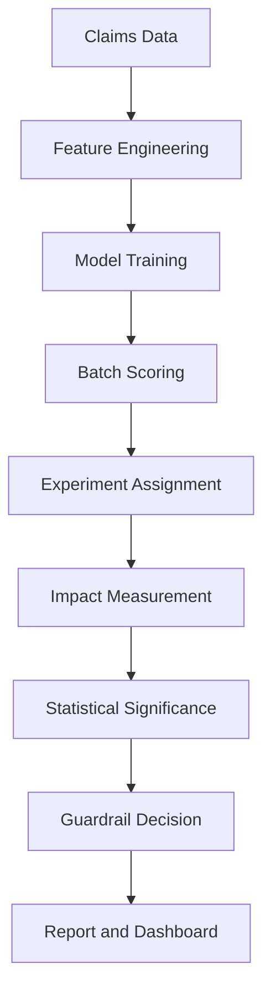

# Claim FDS
## 정책 효과 검증 및 확장 의사결정 시스템

---

# 1. 목적

본 시스템은 보험금 사기 탐지 모델을 “예측 성능” 중심으로 운영하기 위한 도구가 아니라  
**정책 적용 효과(재무 절감)를 측정하고 확대 여부를 판단하기 위한 운영 체계**임  

핵심 목적은 다음과 같음  

- 통제군 대비 처리군의 **재무 절감 효과** 산출했음  
- 효과의 **통계적 유의성** 검증했음  
- **세그먼트별 효과 차이(HTE)** 확인했음  
- **가드레일** 통과 시에만 정책 확대하도록 설계했음  
- 결과를 대시보드 및 리포트 산출물로 일관 제공했음  

---

# 2. 주요 기능

- 청구 단위 리스크 점수 산출 및 처리/통제 실험 적용했음  
- 지급액(원) 기반 효과(절감) 및 검토 전환율 변화 측정했음  
- Welch t-test 기반 유의성 검정 및 p-value 산출했음  
- 세그먼트 경보 및 가드레일 판정으로 안전장치 구성했음  
- One-pager PDF 및 이메일 리포트 자동 생성했음  
- Streamlit 대시보드에서 “핵심 메시지 → 근거 → 실행 권고” 구조로 표시했음  

---

# 3. 기술 스택

- Python 3.10+ 사용했음  
- Streamlit 사용해 대시보드 제공했음  
- pandas / numpy 기반 데이터 처리했음  
- SciPy 기반 통계 검정(Welch t-test) 사용했음  
- joblib 기반 모델 직렬화(Champion/Challenger) 사용했음  
- ReportLab 기반 One-pager PDF 생성했음  
- SMTP 기반 이메일 발송 모듈 포함했음  

---

# 4. 전체 아키텍처



---

# 5. 아키텍처 구성요소별 목적 및 수행 내용

| 구성요소 | 목적 | 무엇을 | 어떻게(주요 파일) |
|---|---|---|---|
| Claims Data | 분석/운영 입력 확보 | 청구 원천 데이터 적재 | `data/claims.csv`, 로딩 `src/io_utils.py` |
| Feature Engineering | 모델 입력 정규화 | 인코딩/스케일링/파생변수 생성 | `src/features.py` |
| Model Training | 점수 산출 모델 생성 | 학습/검증/보정 수행 | `src/train.py`, `src/validate.py`, `src/calibrate.py` |
| Batch Scoring | 운영 점수 생성 | 청구별 score/결정 원장 생성 | `src/score_batch_prod.py` → `out/decision_ledger.csv` |
| Experiment Assignment | 효과 측정 설계 | CONTROL/TREATMENT 배정 | `src/experiment.py` (`assign_group`) |
| Impact Measurement | 재무 효과 산출 | 통제-처리 차이 및 추세 생성 | `src/impact_panel.py`, `out/impact_panel.csv` |
| Statistical Significance | 유의성 검증 | Welch t-test로 p-value 산출 | `src/stats_impact_scipy.py`, `out/impact_significance_scipy.csv` |
| Segment Alerts | 리스크 집중 감시 | 세그먼트 다중검정/경보 생성 | `src/segment_alerts.py` (`bh_fdr`) |
| Guardrail Decision | 확장 안전장치 | GO/HOLD/ROLLBACK 판정 | `src/guardrails.py` (`main`, `_emit`) |
| Report Generation | 결과 산출물 제공 | md/pdf/차트 생성 | `src/executive_report.py`, `src/pdf_onepager.py`, `src/executive_charts.py` |
| Dashboard & Email | 소비 채널 제공 | 대시보드 표시/메일 발송 | `app_exec_dashboard.py`, `src/send_report_email.py` |

---

# 6. 레포 구조 (v5.5 실파일 기준)

```
app_exec_dashboard.py
requirements.txt
Makefile
.env.example
.streamlit/

assets/
data/
models/
out/
src/
scripts/   # (추가) 운영 재현 스크립트
```

---

# 7. 운영 흐름 (End-to-End) — 상세 단계

아래 단계는 “산출물(out/) 생성 → 대시보드 렌더링”까지의 표준 경로임  

## 7.1 데모 산출물 생성(권장 시작점)
- 파일: `src/simulate_production_outputs.py`
- 목적: 운영 산출물(out/)을 모조 데이터로 일괄 생성했음  
- 실행: `python -m src.simulate_production_outputs --scenario GO --days 120 --seed 42`  

## 7.2 운영형 전체 파이프라인(학습→스코어링→효과→리포트)
- 학습: `python -m src.train` 수행했음  
- 검증: `python -m src.validate` 수행했음  
- 보정: `python -m src.calibrate` 수행했음  
- 스코어링: `python -m src.score_batch_prod` 수행했음  
- (선택) C/C 비교: `python -m src.score_cc` 수행했음  
- 실험 배정: `python -m src.experiment` 수행했음  
- 효과 측정: `python -m src.impact_panel` 수행했음  
- 유의성: `python -m src.stats_impact_scipy` 수행했음  
- 세그먼트 경보: `python -m src.segment_alerts` 수행했음  
- 가드레일: `python -m src.guardrails` 수행했음  
- 리포트/차트: `python -m src.executive_report`, `python -m src.executive_charts` 수행했음  
- PDF: `python -m src.pdf_onepager` 수행했음  
- 대시보드: `streamlit run app_exec_dashboard.py` 수행했음  

---

# 8. 대시보드 UI 라벨(한글) ↔ KPI 매핑 1:1

본 섹션은 `app_exec_dashboard.py` 기준으로 “화면 표시 라벨”을 정확히 기록한 것임  

## 8.1 상단 KPI 영역(한 줄 요약)
| 표시 라벨 | 산출 값 | 주요 입력 | 계산 위치 |
|---|---|---|---|
| `MTD 절감(추정)` / `월 절감(추정)` | 월 누적 절감 추정 | `out/impact_monthly_timeseries.csv` 우선, 없으면 `out/decision_ledger.csv` | `src/telemetry.py` → `compute_saving_kpis()` |
| `금일 청구 건수` | 금일 청구 n | `out/decision_ledger.csv` | `src/telemetry.py` → `compute_ops_kpis()` |
| 배지 `GO/HOLD/ROLLBACK`, `p=...`, `경보 0건` | 상태/참고값 | `out/guardrails_decision.csv`, `out/segment_alerts.csv` | `app_exec_dashboard.py` → `guardrail()` |

## 8.2 KPI 탭 라벨(표시 그대로)
- KPI 탭: `재무 성과`, `운영 지표`, `품질·가드레일`  
- 페이지 탭: `임원 요약`, `효과 분석`, `세그먼트·요인`, `운영`, `근거`  

## 8.3 카드 라벨(표시 그대로)
아래 라벨은 `card("...")` 호출에서 추출했음  

- `MTD 절감(추정)`, `SLA 위반`, `가드레일 상태`, `건당 지급 개선액`, `검토 전환율`, `관측 효과(건당)`, `금일 청구 건수`, `기간 청구 건수`, `대기 건수`, `분기 누적 절감(추정)`, `세그먼트 경보`, `월 절감(추정)`, `유의확률(p)`, `처리 비중`, `처리 완료`, `처리군 표본수`, `총 청구 건수`, `통제군 표본수`, `평균 리스크 점수`
- 진행(미니): `월 목표 달성률`

---

# 9. 지표(카드)별 입력파일 ↔ 계산 함수 ↔ 상위 산출 로직 매핑

| 표시 라벨 | 입력(out/) | 계산/포맷 함수 | 상위 산출 스크립트 |
|---|---|---|---|
| `MTD 절감(추정)` / `월 절감(추정)` | `impact_monthly_timeseries.csv`(우선) / `decision_ledger.csv`(fallback) | `src.telemetry.compute_saving_kpis()` 내부에서 `compute_savings_from_timeseries()` → fallback `compute_savings_from_ledger()` | 데모: `simulate_production_outputs.py` / 운영: `impact_panel.py` + ledger |
| `오늘 절감(추정)`(리포트/근거 영역) | 동일 | `src.telemetry.compute_saving_kpis()` → `saving_today` | 동일 |
| `분기 누적 절감(추정)` | 동일 | `src.telemetry.compute_saving_kpis()` → `saving_qtd` | 동일 |
| `금일 청구 건수` | `decision_ledger.csv` | `src.telemetry.compute_ops_kpis()` → `n_claims_today` | `score_batch_prod.py` |
| `검토 전환율` | `decision_ledger.csv` | `src.telemetry.compute_ops_kpis()` → `review_rate` | `experiment.py` + ledger |
| `처리 비중` | `decision_ledger.csv` | `src.telemetry.compute_ops_kpis()` → `treat_share` | `experiment.py` |
| `평균 리스크 점수` | `decision_ledger.csv` | `src.telemetry.compute_ops_kpis()` → `avg_model_score` | `score_batch_prod.py` |
| `월 목표 달성률` | `impact_monthly_timeseries.csv` + 목표값 | `app_exec_dashboard.py` → `mini_progress()` | 목표: `src/config.py`(CFG) |
| `가드레일 상태` / `유의확률(p)` / `세그먼트 경보` | `guardrails_decision.csv`, `segment_alerts.csv`, `impact_significance_scipy.csv` | `app_exec_dashboard.py` → `guardrail()` (배지/카드) | `guardrails.py`, `segment_alerts.py`, `stats_impact_scipy.py` |
| `관측 효과(건당)` / `통제군 표본수` / `처리군 표본수` | `impact_panel.csv` | 대시보드에서 CSV 읽어 포맷(`krw`, `fmt_int`) | `impact_panel.py` |
| `대기 건수` / `SLA 위반` / `처리 완료` | `review_queue.csv` 또는 ledger 파생 | `src.telemetry.compute_ops_kpis()` 또는 대시보드 집계 | 운영/데모 생성 로직 |

---

# 10. 통계/추정 로직 및 수식 (표)

| 항목 | 목적 | 수식 | 구현 위치 |
|---|---|---|---|
| 평균 효과(절감) | 처리 정책의 평균 절감 확인 | \( \Delta = \mathbb{E}[Y\mid C] - \mathbb{E}[Y\mid T] \) | `src/impact_panel.py`(패널), KPI는 `src/telemetry.compute_saving_kpis()` |
| HTE | 세그먼트별 효과 차이 확인 | \( HTE_s = \mathbb{E}[Y\mid C,S=s] - \mathbb{E}[Y\mid T,S=s] \) | `app_exec_dashboard.py` → `compute_hte()` |
| Welch t-test | 평균 차이 유의성 검정 | \( t = \frac{\bar{X}_c-\bar{X}_t}{\sqrt{s_c^2/n_c + s_t^2/n_t}} \) | `src/stats_impact_scipy.py` → `main()` |
| p-value | 우연일 확률 평가 | \( p = P(|T| \ge |t|) \) | `src/stats_impact_scipy.py` |
| BH-FDR | 세그먼트 다중검정 보정 | \( q = \text{BH-FDR}(p_1,\dots,p_m) \) | `src/segment_alerts.py` → `bh_fdr()` |

---

# 12. 실행 방법

## 12.1 requirements 설치
```bash
python -m venv .venv
source .venv/bin/activate
pip install -r requirements.txt
```

## 12.2 데모 산출물 생성(권장)
```bash
python -m src.simulate_production_outputs --scenario GO --days 120 --seed 42
```

## 12.3 대시보드 실행
```bash
streamlit run app_exec_dashboard.py --server.address 0.0.0.0 --server.port 8501
```

## 12.4 Makefile 기반 실행(권장)

```bash
# 1) 가상환경 생성 + requirements 설치
make install

# 2) 데모 산출물 생성(빠름)
make demo

# 3) 대시보드 실행
make dashboard
```

풀 파이프라인 실행도 가능함  

```bash
make full
make dashboard
```

## 12.5 Shell Script 기반 실행(1회 실행)

```bash
# 데모(권장)
bash scripts/run_all.sh demo

# 풀 파이프라인
bash scripts/run_all.sh full
```

## 12.6 Dashboard 샘플

https://awesome-fds-9qyj9byrubzicscijfsgnh.streamlit.app/ 

---

# License

Internal Use Only
