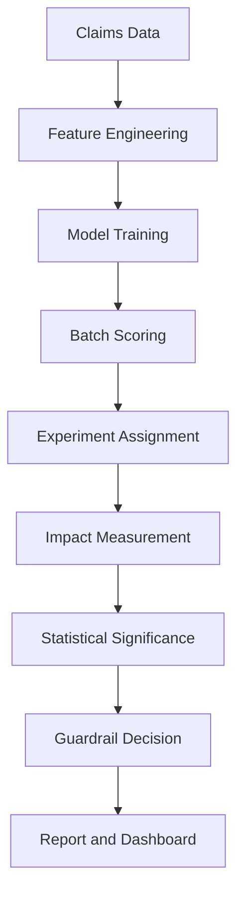

# Claim FDS
## 정책 효과 검증 및 확장 의사결정 시스템

---

# 1. 목적

본 시스템은 보험금 사기 탐지 모델을 “예측 성능” 중심으로 운영하기 위한 도구가 아니라  
**정책 적용 효과를 측정하고 확대 여부를 판단하기 위한 운영 체계**임  

핵심 목적은 다음과 같음  

- 통제군 대비 처리군의 **재무 절감 효과** 산출했음  
- 효과의 **통계적 유의성** 검증했음  
- **세그먼트별 효과 차이(HTE)** 확인했음  
- **가드레일** 통과 시에만 정책 확대하도록 설계했음  
- 결과를 대시보드 및 리포트 산출물로 일관 제공했음  

---

# 2. 주요 기능

- 배치 스코어링 기반 **청구 단위 리스크 점수 산출**했음  
- Control/Treatment 실험군 배정 및 처리 비중 제어했음  
- 지급액 기반 효과(절감) 및 검토 전환율 변화 측정했음  
- Welch t-test 기반 유의성 검정 및 p-value 산출했음  
- 세그먼트 경보 및 가드레일 판정으로 안전장치 구성했음  
- One-pager PDF 및 이메일 리포트 자동 생성했음  
- Streamlit 대시보드에서 “요약→근거→조치” 구조로 표시했음  

---

# 3. 기술 스택

- Python 3.10+ 사용했음  
- Streamlit 사용해 대시보드 제공했음  
- pandas / numpy 기반 데이터 처리했음  
- SciPy 기반 통계 검정(Welch t-test) 사용했음  
- joblib 기반 모델 직렬화(Champion/Challenger) 사용했음  
- ReportLab 기반 One-pager PDF 생성했음  
- SMTP 기반 이메일 발송 모듈 포함했음  

---

# 4. 전체 아키텍처



---

# 5. 레포 구조 (v5.5 실파일 기준)

```
app_exec_dashboard.py
requirements.txt
Makefile
.env.example

assets/
  ci.json

data/
  claims.csv

models/
  champion.joblib
  challenger.joblib
  fraud_lr.joblib
  meta.json
  meta_champion.json
  meta_challenger.json
  policy_registry.json

out/
  decision_ledger.csv
  impact_causal.csv
  impact_panel.csv
  impact_significance_scipy.csv
  impact_monthly_timeseries.csv
  guardrails_decision.csv
  segment_alerts.csv
  cc_metrics.csv
  review_queue.csv
  executive_summary.md
  executive_onepager.pdf
  chart_cumulative_saving.png
  chart_monthly_saving.png

src/
  features.py
  train.py
  validate.py
  calibrate.py
  score_batch_prod.py
  score_cc.py
  experiment.py
  impact_causal.py
  impact_panel.py
  stats_impact_scipy.py
  guardrails.py
  segment_alerts.py
  explainability.py
  executive_report.py
  executive_charts.py
  pdf_onepager.py
  render_email.py
  emailer.py
  send_report_email.py
  rollout_controller.py
  promote_if_better.py
  policy_registry.py
  registry.py
  update_labels.py
  telemetry.py
  io_utils.py
  config.py
  simulate_production_outputs.py
```

---

# 6. 운영 흐름 (End-to-End) — 상세 단계

아래 단계는 “생산 산출물(out/) 생성 → 대시보드 렌더링”까지의 표준 경로임  

## 6.1 데이터 적재
- 입력 파일: `data/claims.csv` 사용했음  
- 로딩 유틸: `src/io_utils.py`의 `read_csv()` 사용했음  

## 6.2 피처 파이프라인 준비
- 파일: `src/features.py`
- 함수: `build_preprocessor()` 사용했음  
- 인코딩/스케일링 포함한 전처리기 구성했음  

## 6.3 모델 학습 및 검증
- 학습 실행 파일: `src/train.py`
  - 엔트리: `main()` 사용했음  
- 검증 실행 파일: `src/validate.py`
  - 엔트리: `main()` 사용했음  
- 확률 보정 파일: `src/calibrate.py`
  - 함수: `calibrate()` 사용했음  
- 산출물: `models/champion.joblib`, `models/challenger.joblib` 저장했음  

## 6.4 배치 스코어링(운영 점수 산출)
- 파일: `src/score_batch_prod.py`
  - 함수: `_get_X()`로 입력 행렬 구성했음  
  - 엔트리: `main()`로 배치 스코어링 수행했음  
- 산출물: `out/decision_ledger.csv` 생성했음  

## 6.5 Champion/Challenger 비교(선택)
- 파일: `src/score_cc.py`
  - 함수: `_get_X()` 사용했음  
  - 엔트리: `main()` 사용했음  
- 산출물: `out/cc_metrics.csv` 생성했음  

## 6.6 실험군 배정(Control/Treatment)
- 파일: `src/experiment.py`
  - 함수: `assign_group()` 사용했음  
- 결과 컬럼: `exp_group`에 CONTROL/TREATMENT 할당했음  

## 6.7 효과 측정(Impact) 및 패널 생성
- 인과 추정(선택): `src/impact_causal.py` → `main()` 수행했음  
  - 산출물: `out/impact_causal.csv` 생성했음  
- 패널 취합: `src/impact_panel.py` → `main()` 수행했음  
  - `impact_causal.csv` + `impact_significance_scipy.csv`를 결합해 `out/impact_panel.csv` 생성했음  

## 6.8 통계 유의성 검정
- 파일: `src/stats_impact_scipy.py`
  - 엔트리: `main()` 수행했음  
- 산출물: `out/impact_significance_scipy.csv` 생성했음  

## 6.9 세그먼트 경보
- 파일: `src/segment_alerts.py`
  - 함수: `bh_fdr()`로 다중검정 보정 적용했음  
  - 엔트리: `main()` 수행했음  
- 산출물: `out/segment_alerts.csv` 생성했음  

## 6.10 가드레일 판정
- 파일: `src/guardrails.py`
  - 엔트리: `main()` 수행했음  
  - 내부 출력: `_emit()` 사용했음  
- 산출물: `out/guardrails_decision.csv` 생성했음  

## 6.11 리포트/차트 생성 및 배포
- 요약 생성: `src/executive_report.py` → `main()` 수행했음  
  - 산출물: `out/executive_summary.md` 생성했음  
- 차트 생성: `src/executive_charts.py` → `main()` 수행했음  
  - 산출물: `out/chart_cumulative_saving.png`, `out/chart_monthly_saving.png` 생성했음  
- PDF 생성: `src/pdf_onepager.py`
  - 함수: `export_onepager_pdf()` 사용했음  
  - 산출물: `out/executive_onepager.pdf` 생성했음  
- 이메일 발송(선택): `src/send_report_email.py` → `main()` 수행했음  
  - HTML 렌더: `src/render_email.py`의 `build_email_html()` 사용했음  
  - 전송: `src/emailer.py`의 `send_email()` 사용했음  

## 6.12 대시보드 렌더링
- 파일: `app_exec_dashboard.py`
- out/*.csv를 읽어 KPI 및 메시지 생성했음  
- KPI 계산/표현은 `app_exec_dashboard.py` 내부 함수로 일관 처리했음  

---

# 7. 대시보드 KPI ↔ 코드(파일/함수) 100% 매핑

아래 표는 “대시보드에 보이는 지표”가 **어느 파일의 어느 함수에서 계산되는지**를 교차 확인한 결과임  

| 지표(표시) | 입력 파일(out/) | 대시보드 계산 함수(app_exec_dashboard.py) | 상위 산출 로직(스크립트/함수) |
|---|---|---|---|
| 오늘 절감(추정) | `impact_monthly_timeseries.csv` 또는 `decision_ledger.csv` | `compute_savings_kpi_bundle()` → `compute_savings_from_timeseries()` / `compute_savings_from_ledger()` | 시뮬레이션: `simulate_production_outputs.py` → `run()` / 운영: `stats_impact_scipy.py`의 효과 + ledger 기반 |
| MTD 절감(추정) | 동일 | 동일 | 동일 |
| 분기 누적 절감(추정) | 동일 | 동일 | 동일 |
| 금일 청구 건수 | `decision_ledger.csv` | `compute_experiment_summary()` (내부에서 `compute_experiment_daily()`) | 운영 ledger: `score_batch_prod.py` → `main()` |
| 검토 전환율 | `decision_ledger.csv` | `compute_experiment_summary()` | `experiment.py` → `assign_group()` + ledger `decision` 컬럼 |
| 처리 비중(Treatment share) | `decision_ledger.csv` | `compute_experiment_summary()` | `experiment.py` → `assign_group()` |
| 평균 리스크 점수 | `decision_ledger.csv` | `compute_experiment_summary()` | `score_batch_prod.py` → `main()` |
| 가드레일 상태(GO/HOLD/ROLLBACK) | `guardrails_decision.csv` | `guardrail()` | `guardrails.py` → `main()` |
| p-value | `impact_significance_scipy.csv` 또는 `guardrails_decision.csv` | `pvalue()` + `guardrail()` | `stats_impact_scipy.py` → `main()` |
| 세그먼트 경보 건수 | `segment_alerts.csv` | `guardrail()` | `segment_alerts.py` → `main()` |
| HTE Top(세그먼트별) | `decision_ledger.csv` | `compute_hte()` + `hte_top_table_for_display()` | dashboard 내부 계산(ledger groupby) |
| Drivers 카테고리 | `decision_ledger.csv`(rule/ reason) | `attach_rule_reasons()` + `build_driver_category_table()` | ledger에 reason이 없으면 `simulate_production_outputs.py`에서 생성했음 |

---

# 8. 통계/추정 로직 및 수식 (표 형태)

| 항목 | 목적 | 수식 | 구현 파일/함수 |
|---|---|---|---|
| 평균 효과(절감) | 처리 정책의 평균 절감 확인 | \( \Delta = \mathbb{E}[Y\mid C] - \mathbb{E}[Y\mid T] \) | 대시보드: `compute_savings_from_ledger()` / `compute_savings_from_timeseries()` |
| HTE | 세그먼트별 효과 차이 확인 | \( HTE_s = \mathbb{E}[Y\mid C,S=s] - \mathbb{E}[Y\mid T,S=s] \) | `app_exec_dashboard.py` → `compute_hte()` |
| Welch t-test | 평균 차이의 유의성 검정 | \( t = \frac{\bar{X}_c-\bar{X}_t}{\sqrt{s_c^2/n_c + s_t^2/n_t}} \) | `stats_impact_scipy.py` → `main()` (SciPy 사용) |
| p-value | 우연일 확률 평가 | \( p = P(|T| \ge |t|) \) | `stats_impact_scipy.py` → `main()` |
| BH-FDR | 세그먼트 다중검정 보정 | \( q = \text{BH-FDR}(p_1,\dots,p_m) \) | `segment_alerts.py` → `bh_fdr()` |

---

# 9. 실행 방법

## 9.1 requirements 설치
```bash
python -m venv .venv
source .venv/bin/activate
pip install -r requirements.txt
```

## 9.2 데모 산출물 생성(로컬 실행용)
```bash
python -m src.simulate_production_outputs --scenario GO --days 120 --seed 42
```

## 9.3 대시보드 실행
```bash
streamlit run app_exec_dashboard.py --server.address 0.0.0.0 --server.port 8501
```

---

# 10. Dashboard URL

https://github.com/Obok-obok/awesome-fds  

---

# License

Internal Use Only
